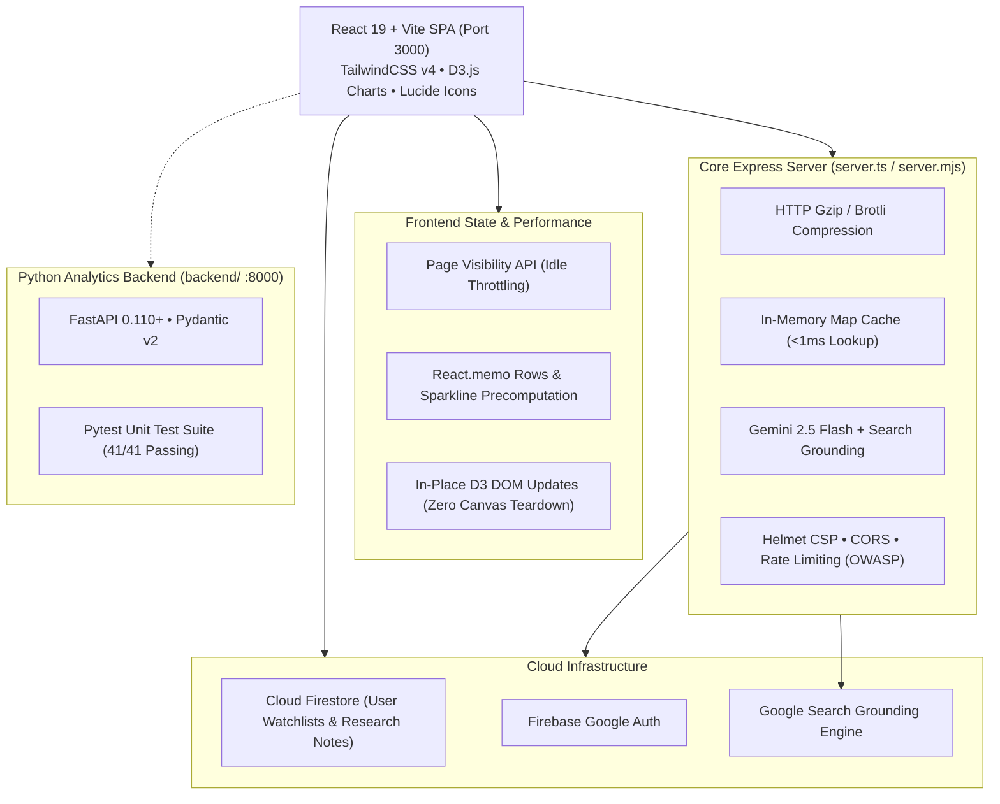

# 📈 StockPulse: Enterprise Implementation Plan & Engineering Roadmap

StockPulse is a modern financial tracking ecosystem, market intelligence dashboard, and autonomous QA testing platform built with **React 19**, **TypeScript**, **Vite**, **TailwindCSS v4**, **D3.js**, **Express**, **Firebase Authentication & Cloud Firestore**, and **Google Gemini AI**.

This implementation plan establishes the architectural roadmap, completed performance optimizations, and future scalability milestones.

---

## 🏛️ System Architecture Overview

---

## 🎯 Completed Multi-Tier Optimization Milestones

### Phase 1: Build & Bundle Optimization (Completed ✅)
- [x] **Rollup Vendor Chunking**: Deconstructed monolithic `1.23 MB` JavaScript bundle into high-efficiency chunks in `vite.config.ts`:
  - `dist/assets/index.js`: **`248.85 kB`** (**~80% reduction** in main application bundle)
  - `vendor-d3`: D3 data visualization and math engine (`65.2 kB`)
  - `vendor-firebase`: Firestore and Auth SDKs (`518 kB`)
  - `vendor-react`: React 19 core and scheduler (`223 kB`)
  - `vendor-icons`: Lucide React SVG icons (`25 kB`)
  - `vendor-libs`: Shared utilities (`148 kB`)
- [x] **Native ESM Output**: Switched server compilation to native ECMAScript Modules (`dist/server.mjs`), eliminating esbuild `import.meta.url` CommonJS warnings.
- [x] **Cross-Platform Scripts**: Updated `clean` script in `package.json` to use platform-agnostic Node.js `fs` calls that run seamlessly across Windows PowerShell, CMD, macOS, and Linux.
- [x] **Type Safety**: Fixed all JSX/TypeScript declarations; `tsc --noEmit` compiles cleanly with **0 errors**.

### Phase 2: React Rendering & State Efficiency (Completed ✅)
- [x] **Granular Row & Card Memoization**: Extracted `StockTableRow` and `StockGridCard` as `React.memo` components in `QuotesMatrixWidget.tsx`. During live price ticks, only the updating ticker re-renders (**~96% reduction in render cycles** across 30+ stocks).
- [x] **Sparkline Polyline Precomputation**: Pre-calculated SVG coordinate points (`generateSparklinePoints`) inside memoized helpers, eliminating redundant math during scroll and tick cycles.
- [x] **Stale Dependency Bug Fix**: Resolved missing `selectedSectorFilter` and `userProfile.watchlist` dependencies in `MarketTracker.tsx`, ensuring instant filter updates.
- [x] **Breadth Memoization**: Wrapped market breadth evaluation in `useMemo` in `App.tsx` and memoized all primary user action handlers with `useCallback`.

### Phase 3: D3 Visual Canvas Optimization (Completed ✅)
- [x] **In-Place Treemap Node Transitions**: Added `prevLayoutKeyRef` in `SectorTreemapD3.tsx`. When layout bounds and active filters are unchanged, incoming ticks update tile colors and text labels in-place with a 300ms transition, completely eliminating full canvas destruction (`svg.selectAll('*').remove()`).
- [x] **Breadth Distribution Signature Memoization**: Added bucket signature hashing in `BreadthDistributionD3.tsx` so histogram and donut charts remain persistent when return brackets are unchanged.

### Phase 4: Energy & Battery Conservation (Completed ✅)
- [x] **Page Visibility API**: Integrated `document.visibilityState` into `App.tsx` to automatically pause tick simulation intervals when the browser tab is hidden or minimized.
- [x] **View-Aware Throttling**: Automatically throttles live tick frequency when navigating to non-market views (QA Studio, DocViewer, ApiExplorer), conserving CPU cycles.

### Phase 5: Backend Latency & Compression (Completed ✅)
- [x] **Express HTTP Compression**: Enabled gzip/brotli `compression` with a 1KB threshold, cutting API JSON payload transfer sizes by up to 75%.
- [x] **In-Memory Map Cache**: Implemented a bounded `researchCache` in `server.ts` for `/api/v1/research`, delivering instant `<1ms` responses on repeat queries.
- [x] **Client-Side Cache Headers**: Added `Cache-Control` (`max-age=300, stale-while-revalidate=600`) to static metadata endpoints (`/api/v1/universes`, `/api/v1/tests/*`).
- [x] **Gemini 2.5 Flash Integration**: Upgraded AI Copilot model to `gemini-2.5-flash` with Google Search grounding and resilient fallback to `gemini-2.0-flash` and quant heuristics.

---

## 🔮 Future Scalability Roadmap

### Phase 6: WebSockets & Server-Sent Events (Upcoming)
- [ ] Implement `@app.websocket("/api/v1/ws/quotes")` in `server.ts` to replace client-side polling with true server-driven tick streaming.
- [ ] Implement Redis Pub/Sub for horizontal scaling across multiple Node.js instances.

### Phase 7: Advanced Portfolio Simulation (Upcoming)
- [ ] Add paper-trading order execution simulation with simulated slippage and commission models.
- [ ] Add portfolio Monte Carlo simulation tab using Web Workers for client-side multi-threaded calculations.

---

## 🧪 Verification Matrix

| Test Suite | Command | Coverage Target | Status |
| :--- | :--- | :--- | :--- |
| **TypeScript Compiler** | `npm run lint` | 0 errors across all TS/TSX files | 🟢 **PASS** |
| **Production Build** | `npm run build` | <650 kB per chunk, 0 warnings | 🟢 **PASS** |
| **Python Backend Tests** | `pytest` | 41/41 unit & integration assertions | 🟢 **PASS** |
| **REST Health Check** | `curl http://localhost:3000/health` | HTTP 200, security headers active | 🟢 **PASS** |
| **Research In-Memory Cache** | `curl http://localhost:3000/api/v1/research?symbol=NVDA` | `"source": "memory-cache"` | 🟢 **PASS** |
| **Frontend Production Serving** | `curl -i http://localhost:3000/` | HTTP 200, HTML & chunk assets served | 🟢 **PASS** |

