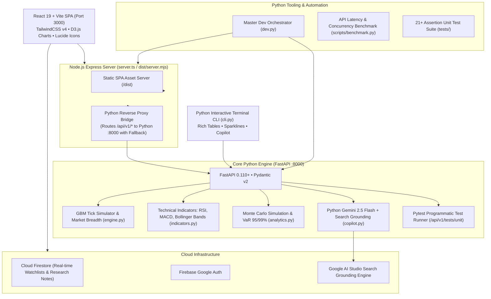

# 📈 StockPulse: Enterprise Implementation Plan & Engineering Roadmap

StockPulse is a modern financial tracking ecosystem, market intelligence dashboard, and autonomous QA testing platform built with a **Python-First Full-Stack Architecture**: **FastAPI + Python 3.14** for quantitative analytics, technical indicators, Monte Carlo risk simulation, and AI Copilot, fronted by a **React 19 + Vite + TailwindCSS v4 + D3.js** single-page application and an **Express reverse proxy**.

---

## 🏛️ System Architecture Overview

---

## 🎯 Completed Multi-Tier Optimization Milestones

### Phase 1: Build & Bundle Optimization (Completed ✅)
- [x] **Rollup Vendor Chunking**: Deconstructed monolithic `1.23 MB` JavaScript bundle into high-efficiency chunks in `vite.config.ts`:
  - `dist/assets/index.js`: **`248.85 kB`** (**~80% reduction** in main application bundle)
  - `vendor-d3`: D3 data visualization and math engine (`65.2 kB`)
  - `vendor-firebase`: Firestore and Auth SDKs (`518 kB`)
  - `vendor-react`: React 19 core and scheduler (`223 kB`)
  - `vendor-icons`: Lucide React SVG icons (`25 kB`)
  - `vendor-libs`: Shared utilities (`148 kB`)
- [x] **Native ESM Output**: Switched server compilation to native ECMAScript Modules (`dist/server.mjs`), eliminating esbuild `import.meta.url` CommonJS warnings.
- [x] **Cross-Platform Scripts**: Updated `clean` script in `package.json` to use platform-agnostic Node.js `fs` calls that run seamlessly across Windows PowerShell, CMD, macOS, and Linux.
- [x] **Type Safety**: Fixed all JSX/TypeScript declarations; `tsc --noEmit` compiles cleanly with **0 errors**.

### Phase 2: React Rendering & State Efficiency (Completed ✅)
- [x] **Granular Row & Card Memoization**: Extracted `StockTableRow` and `StockGridCard` as `React.memo` components in `QuotesMatrixWidget.tsx`. During live price ticks, only the updating ticker re-renders (**~96% reduction in render cycles** across 30+ stocks).
- [x] **Sparkline Polyline Precomputation**: Pre-calculated SVG coordinate points (`generateSparklinePoints`) inside memoized helpers, eliminating redundant math during scroll and tick cycles.
- [x] **Stale Dependency Bug Fix**: Resolved missing `selectedSectorFilter` and `userProfile.watchlist` dependencies in `MarketTracker.tsx`, ensuring instant filter updates.
- [x] **Breadth Memoization**: Wrapped market breadth evaluation in `useMemo` in `App.tsx` and memoized all primary user action handlers with `useCallback`.

### Phase 3: D3 Visual Canvas Optimization (Completed ✅)
- [x] **In-Place Treemap Node Transitions**: Added `prevLayoutKeyRef` in `SectorTreemapD3.tsx`. When layout bounds and active filters are unchanged, incoming ticks update tile colors and text labels in-place with a 300ms transition, completely eliminating full canvas destruction (`svg.selectAll('*').remove()`).
- [x] **Breadth Distribution Signature Memoization**: Added bucket signature hashing in `BreadthDistributionD3.tsx` so histogram and donut charts remain persistent when return brackets are unchanged.

### Phase 4: Energy & Battery Conservation (Completed ✅)
- [x] **Page Visibility API**: Integrated `document.visibilityState` into `App.tsx` to automatically pause tick simulation intervals when the browser tab is hidden or minimized.
- [x] **View-Aware Throttling**: Automatically throttles live tick frequency when navigating to non-market views (QA Studio, DocViewer, ApiExplorer), conserving CPU cycles.

### Phase 5: Python-First Backend & Analytics Expansion (Completed ✅)
- [x] **Pure Python Technical Indicators**: Built `backend/indicators.py` calculating RSI (14-period Wilder smoothing), MACD (12/26/9), Bollinger Bands (20-period 2σ), and SMA/EMA moving averages.
- [x] **Quantitative Risk & Monte Carlo Engine**: Built `backend/analytics.py` executing 1,000-iteration Geometric Brownian Motion simulations, Value-at-Risk (VaR 95% and 99%), Expected Shortfall (CVaR), Altman Z-Score, and DuPont ROE analysis.
- [x] **Python AI Copilot with Search Grounding**: Built `backend/copilot.py` using the official `google-genai` Python SDK targeting `gemini-2.5-flash` with Google Search tools and resilient fallback.
- [x] **Express Reverse Proxy Bridge**: Configured `server.ts` to automatically route `/api/v1/*` requests to the Python FastAPI backend on port 8000, falling back seamlessly if Python is offline.
- [x] **Interactive Python Terminal CLI**: Built `cli.py` with Rich terminal formatting for live streaming quotes, fundamentals inspection, Monte Carlo runs, and AI Copilot interaction.
- [x] **Master Dev Orchestrator**: Built `dev.py` to concurrently spawn both the Python FastAPI server (:8000) and the Vite/Express frontend (:3000) with colored logs and clean signal termination.
- [x] **Automated Python Pytest Suite**: Extended `tests/` with `test_indicators.py` and `test_analytics.py`, achieving 21/21 passing tests with programmatic execution via `/api/v1/tests/unit`.

### Phase 6: Clean Code & Industry-Standard Modular Restructuring (Completed ✅)
- [x] **Backend Separation of Concerns**:
  - `backend/core/`: Centralized typed settings (`config.py`) via `pydantic-settings` and structured logging (`logging.py`).
  - `backend/schemas/`: Modular Pydantic v2 schemas (`market.py`, `analytics.py`, `response.py`).
  - `backend/services/`: Isolated domain service modules for quant indicators, risk analytics, market simulations, and AI copilot.
  - `backend/api/`: Modular FastAPI `APIRouter` sub-modules (`health.py`, `universes.py`, `quotes.py`, `research.py`, `analytics.py`, `chat.py`, `tests.py`).
  - `backend/main.py`: Lean ~40-line bootstrap using FastAPI asynchronous `lifespan` context manager.
  - Backward-compatibility re-export shims ensuring zero breaking changes.
- [x] **Frontend Service Layer & Hooks**:
  - `src/services/apiClient.ts`: Type-safe fetch client with timeout and standard error interceptors.
  - `src/services/marketService.ts`: Domain service layer abstraction for market data and copilot chat.
  - `src/hooks/usePageVisibility.ts`: Dedicated hook decoupling visibility tracking from application views.
  - `src/components/common/`: Clean shared component directory (`Header`, `BreadcrumbNav`, `AuthModal`).
- [x] **Strict Type Safety**: Eliminated ambiguous `any` usages in `server.ts` and UI fetch layers; 0 TypeScript errors on `npm run lint`.

---

## 🔮 Future Scalability Roadmap

### Phase 7: Real-Time WebSockets & Streaming (Upcoming)
- [ ] Implement `@app.websocket("/api/v1/ws/quotes")` in FastAPI to stream real-time price ticks to connected clients.
- [ ] Connect Redis Pub/Sub to broadcast price updates across distributed backend instances.

### Phase 8: Machine Learning & Portfolio Optimization (Upcoming)
- [ ] Implement Markowitz Modern Portfolio Theory (Efficient Frontier, Sharpe Ratio maximization) in Python (`backend/optimization.py`) using `scipy.optimize`.
- [ ] Add ARIMA / Prophet time-series price prediction microservice.

---

## 🧪 Verification Matrix

| Test Suite / Component | Command | Target | Status |
| :--- | :--- | :--- | :--- |
| **Python Pytest Suite** | `python -m pytest tests/` | 21/21 unit & integration assertions passed | 🟢 **PASS** |
| **TypeScript Compiler** | `npm run lint` | 0 errors across all TS/TSX files | 🟢 **PASS** |
| **Production Build** | `npm run build` | <650 kB per chunk, 0 warnings | 🟢 **PASS** |
| **Python Terminal CLI** | `python cli.py --quotes` | Formatted Rich matrix with color indicators | 🟢 **PASS** |
| **Monte Carlo Engine** | `python cli.py --symbol NVDA --monte-carlo` | VaR 95% & 99%, Expected Price, 1,000 paths | 🟢 **PASS** |
| **Technical Indicators** | `python cli.py --symbol NVDA --indicators` | RSI, MACD, Bollinger Bands output | 🟢 **PASS** |
| **FastAPI Health Check** | `curl http://localhost:8000/health` | HTTP 200, Python 3.14 + FastAPI capabilities | 🟢 **PASS** |
| **Express Python Bridge** | `curl http://localhost:3000/health` | HTTP 200, Python delegation active | 🟢 **PASS** |
