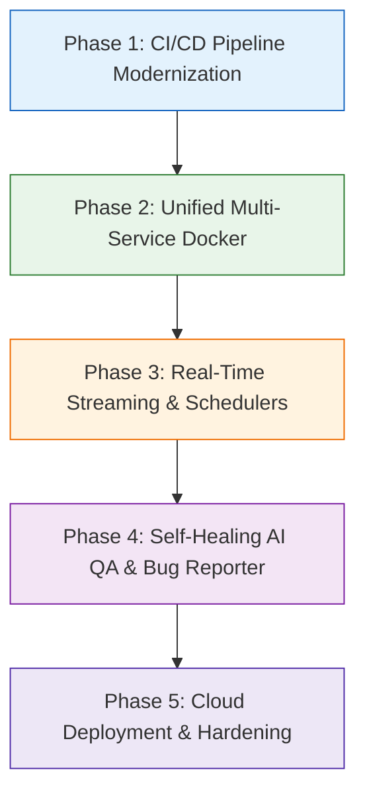

# StockPulse: Comprehensive Engineering Implementation Plan & Evolution Roadmap

This implementation plan establishes the architectural and engineering roadmap for **StockPulse**, transforming it from a local educational prototype into an enterprise-grade financial intelligence platform with continuous automated QA.

---

## User Review Required

> [!IMPORTANT]
> **CI/CD Resource Allocation**: Adding headless Playwright browser tests to GitHub Actions will download Chromium during the CI run (~150MB). We propose caching the browser binary (`~/.cache/ms-playwright`) using `actions/cache@v4` to keep build times under 2 minutes.
> 
> **AI QA in CI/CD**: Running `tests/ai_agent/runner.py` requires an LLM runtime. For CI environments, we can run against a lightweight local runner (or Mock MCP executor) while keeping full live Ollama (`nemotron-3-super:cloud`) for local staging and scheduled nightly runs.

---

## Open Questions

> [!NOTE]
> 1. **Live Quote Streaming**: Would you prefer WebSockets (`/api/v1/ws/quotes`) or Server-Sent Events (SSE) (`/api/v1/sse/quotes`) for real-time tick streaming to replace Streamlit's periodic refresh?
> 2. **AI QA Bug Auto-Reporting**: Should failed autonomous AI test scenarios automatically output formatted GitHub Issue templates or markdown bug tickets in `tests/ai_agent/reports/issues/`?

---

## Proposed Changes

The implementation roadmap is divided into five logical, dependency-ordered phases:



---

### Phase 1: CI/CD Pipeline Modernization (Playwright Integration)

Integrate headless Playwright E2E UI testing into both GitHub Actions and Jenkins pipelines.

#### [MODIFY] [ci.yml](file:///c:/Users/Ishaan/workspace/ai_workspace/Stock_Tracker_App/.github/workflows/ci.yml)
- Add a dedicated `playwright-e2e` job running on `ubuntu-latest`.
- Install Node.js, cache `~/.cache/ms-playwright` and `node_modules`.
- Launch FastAPI and Streamlit background processes in headless mode.
- Run `npx playwright test` headlessly.
- Upload `playwright-report/` and failure traces via `actions/upload-artifact@v4`.

#### [MODIFY] [Jenkinsfile](file:///c:/Users/Ishaan/workspace/ai_workspace/Stock_Tracker_App/Jenkinsfile)
- Add a stage: `stage('Playwright E2E Tests')`.
- Install npm dependencies and run `npm run test:e2e`.
- Archive HTML test reports on build failure or completion.

---

### Phase 2: Unified Multi-Service Docker Architecture

Consolidate the standalone web dashboard, core FastAPI, normalized market-data API, and PostgreSQL into a unified Compose topology.

#### [NEW] [docker-compose.yml](file:///c:/Users/Ishaan/workspace/ai_workspace/Stock_Tracker_App/docker-compose.yml)
- Service `postgres`: PostgreSQL 16 Alpine container with persistent healthchecks and named volume `stockpulse_pgdata`.
- Service `api-core`: FastAPI backend (`src/api.py`) exposing port `8000`.
- Service `market-data`: Normalized EOD market-data service (`src/market_data/api.py`) on port `8001`.
- Service `dashboard`: Streamlit frontend (`main.py`) on port `8501`, connected to internal Docker bridge network.

---

### Phase 3: Real-Time Streaming & Scheduled Ingestion

Upgrade the data layer from static polling to persistent real-time streams and scheduled EOD ingestion.

#### [MODIFY] [api.py](file:///c:/Users/Ishaan/workspace/ai_workspace/Stock_Tracker_App/src/api.py)
- Introduce a WebSocket endpoint `@app.websocket("/api/v1/ws/quotes")` that pushes price updates to subscribed clients as they occur.
- Add an in-memory Pub/Sub broker to broadcast quote ticks across active connections.

#### [MODIFY] [dashboard.py](file:///c:/Users/Ishaan/workspace/ai_workspace/Stock_Tracker_App/src/dashboard.py)
- Replace static sleep/rerun loop with custom JS/Streamlit bridge or SSE listener to consume real-time ticks without full-page re-renders.

#### [NEW] [scheduler.py](file:///c:/Users/Ishaan/workspace/ai_workspace/Stock_Tracker_App/src/market_data/scheduler.py)
- Add a lightweight background cron worker using `APScheduler` to run nightly catalog syncs for NSE, BSE, and US exchanges.

---

### Phase 4: Autonomous AI QA Agent Evolution (Self-Healing & Bug Tickets)

Elevate the Playwright + MCP + Ollama agent from passive test runner to an autonomous QA engineer that files structured bug tickets upon failure.

#### [MODIFY] [runner.py](file:///c:/Users/Ishaan/workspace/ai_workspace/Stock_Tracker_App/tests/ai_agent/runner.py)
- Add an automated bug ticket generator: When a scenario fails (e.g. timeout, missing element, unhandled exception), the agent synthesizes a GitHub-compatible markdown issue in `tests/ai_agent/reports/issues/issue_TCxx.md`.
- Include exact reproduction steps, expected vs actual ARIA tree diffs, and visual screenshot links.
- Add fallback provider support (switch between Ollama `nemotron-3-super:cloud`, Gemini, and local mock executors seamlessly).

---

### Phase 5: Documentation & In-Repo Engineering Roadmap

Persist this comprehensive engineering roadmap within the codebase so contributors and reviewers can track implementation progress.

#### [NEW] [IMPLEMENTATION_PLAN.md](file:///c:/Users/Ishaan/workspace/ai_workspace/Stock_Tracker_App/IMPLEMENTATION_PLAN.md)
- Commit this implementation plan directly to the repository root for team visibility.

---

## Verification Plan

### Automated Tests
1. **Unit Tests**:
   ```powershell
   python -m unittest discover tests
   ```
   *Expected Result:* 41/41 passing.
2. **Playwright E2E Tests**:
   ```powershell
   npm run test:e2e
   ```
   *Expected Result:* All tests in `tests/e2e/` pass headlessly.
3. **Autonomous AI QA Suite**:
   ```powershell
   npm run test:ai
   ```
   *Expected Result:* Scenarios in `tests/ai_agent/test_scenarios.yaml` achieve a 100% pass rate.

### Manual Verification
1. **Multi-Service Docker Verification**:
   - Run `docker compose up -d`.
   - Verify `http://localhost:8501` loads the dashboard.
   - Verify `http://localhost:8000/docs` displays Swagger UI for Core API.
   - Verify `http://localhost:8001/health` confirms market-data service is connected to PostgreSQL.
2. **GitHub Actions CI Verification**:
   - Push to `master` and confirm the new Playwright E2E workflow finishes green on GitHub Actions.
