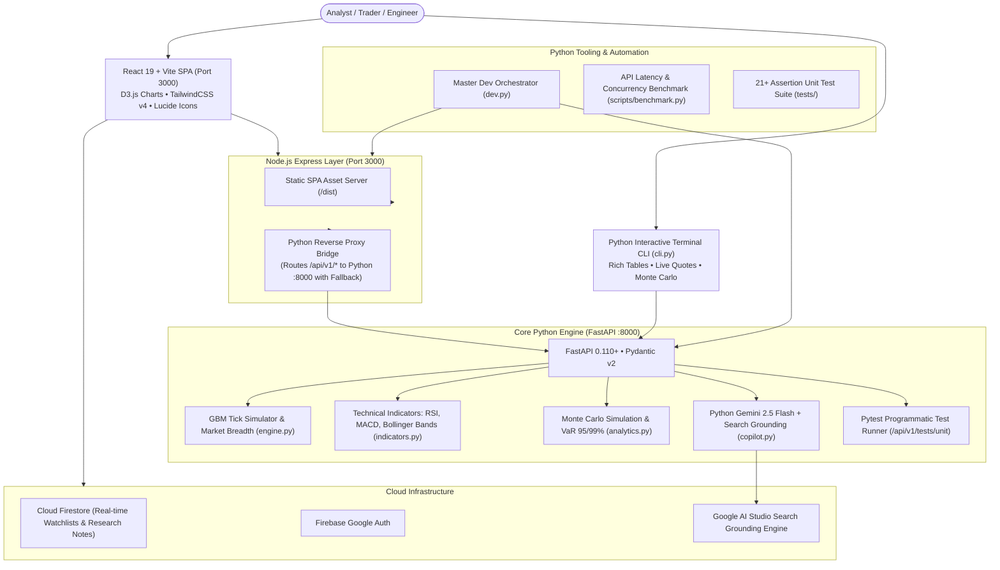

# 📈 StockPulse: Complete Platform Walkthrough & Python Architecture Guide

**StockPulse** is an enterprise-grade financial intelligence platform, quantitative analytics dashboard, and autonomous QA testbed built with a **Python-First Full-Stack Architecture**: a high-performance **Python 3.14 + FastAPI** backend engine for quant calculations, risk modeling, and Gemini AI inference, fronted by a **React 19 + TypeScript + Vite + TailwindCSS v4 + D3.js** single-page application and an **Express reverse proxy**.

---

## 📑 Table of Contents

1. [🏛️ Architecture Overview (Python-First Full Stack)](#️-architecture-overview-python-first-full-stack)
2. [🐍 The Python Engine Ecosystem (`backend/`)](#-the-python-engine-ecosystem-backend)
   - [Quantitative Technical Indicators Engine (`backend/indicators.py`)](#quantitative-technical-indicators-engine-backendindicatorspy)
   - [Monte Carlo Risk & Solvency Engine (`backend/analytics.py`)](#monte-carlo-risk--solvency-engine-backendanalyticspy)
   - [Python AI Copilot (`backend/copilot.py`)](#python-ai-copilot-backendcopilotpy)
   - [FastAPI REST Service (`backend/main.py`)](#fastapi-rest-service-backendmainpy)
3. [💻 Interactive Python Terminal CLI (`cli.py`)](#-interactive-python-terminal-cli-clipy)
4. [🛠️ Python Developer Tooling (`dev.py` & `benchmark.py`)](#️-python-developer-tooling-devpy--benchmarkpy)
5. [🧭 Deep-Dive: The 6 Interactive Views](#-deep-dive-the-6-interactive-views)
6. [🎨 7 Ergonomic Theme Palettes](#-7-ergonomic-theme-palettes)
7. [⚡ Performance Optimization & Benchmark Results](#-performance-optimization--benchmark-results)
8. [🧪 Verification & Testing Runbook](#-verification--testing-runbook)
9. [🚀 Quick Start Commands](#-quick-start-commands)

---

## 🏛️ Architecture Overview (Python-First Full Stack)

StockPulse maximizes the use of Python for all quantitative, financial, risk, and algorithmic computations:



---

## 🐍 The Python Engine Ecosystem (`backend/`)

### Quantitative Technical Indicators Engine (`backend/indicators.py`)
Pure Python implementations of standard financial algorithms:
* **Relative Strength Index (RSI)**: 14-period Wilder smoothed averages calculating overbought (`>=70`) and oversold (`<=30`) momentum states.
* **Moving Average Convergence Divergence (MACD)**: 12-period and 26-period Exponential Moving Averages (EMA) with a 9-period Signal Line and momentum histogram.
* **Bollinger Bands**: 20-period Simple Moving Average with Upper and Lower $2\sigma$ standard deviation bands, bandwidth percentage, and $\%B$ position indicator.
* **Simple & Exponential Moving Averages (SMA/EMA)**: 20-period and 50-period trend-following indicators.
* **Composite Technical Scoring**: Multi-factor scoring (0-100) determining `STRONG_BUY`, `BUY`, `NEUTRAL`, or `SELL` recommendations.

### Monte Carlo Risk & Solvency Engine (`backend/analytics.py`)
* **Geometric Brownian Motion (GBM) Simulation**:
  $$dS_t = \mu S_t dt + \sigma S_t dW_t$$
  Executes 1,000 price path iterations across 30, 90, and 252-day horizons.
* **Value-at-Risk (VaR)**: Calculates maximum statistical dollar and percentage loss at **95%** and **99%** confidence levels.
* **Expected Shortfall (Conditional VaR / CVaR)**: Calculates average loss in extreme 95th percentile tail-risk events.
* **Altman Z-Score**: Evaluates balance sheet solvency and bankruptcy probability across 5 operational financial ratios:
  $$Z = 1.2X_1 + 1.4X_2 + 3.3X_3 + 0.6X_4 + 0.999X_5$$
  Categorizes assets into **Safe Zone** ($Z \ge 2.99$), **Grey Zone** ($1.81 \le Z < 2.99$), and **Distress Zone** ($Z < 1.81$).
* **DuPont 3-Way ROE Decomposition**: Breaks down Return on Equity into Net Profit Margin $\times$ Asset Turnover $\times$ Financial Leverage.

### Python AI Copilot (`backend/copilot.py`)
* Direct integration with `google-genai` Python SDK utilizing **Gemini 2.5 Flash**.
* Enabled with real-time **Google Search Grounding** for live financial news and earnings reports.
* Resilient dual fallback: `gemini-2.5-flash` ➔ `gemini-2.0-flash` ➔ Python Quantitative Heuristics.

### FastAPI REST Service (`backend/main.py`)
High-performance REST API operating on port `8000`:
* `GET /health`: Health metrics, Python 3.14 runtime, and active capabilities.
* `GET /api/v1/universes`: Global listings across 7 market universes.
* `GET /api/v1/quotes`: Real-time quote streaming and market breadth.
* `GET /api/v1/research`: Fundamental financial ratios and stability scores.
* `GET /api/v1/analytics/indicators`: Technical indicator analysis.
* `GET /api/v1/analytics/monte-carlo`: 1,000-run Monte Carlo risk simulations.
* `GET /api/v1/analytics/solvency`: Altman Z-Score and DuPont analysis.
* `POST /api/v1/chat`: Gemini Copilot with market context.
* `GET /api/v1/tests/unit`: Live, programmatic execution of pytest.

---

## 💻 Interactive Python Terminal CLI (`cli.py`)

StockPulse provides a rich terminal interface built with Python's `rich` library:

```powershell
# Interactive Menu
python cli.py

# Instant Quotes Matrix
python cli.py --quotes

# Stock Fundamentals
python cli.py --symbol NVDA

# Technical Indicators
python cli.py --symbol NVDA --indicators

# Monte Carlo 1,000-path Simulation
python cli.py --symbol NVDA --monte-carlo
```

Features:
* Stylized terminal tables with green/red price deltas and formatted market caps.
* Live breadcrumb indicators showing market breadth and advance/decline ratios.
* Interactive AI Copilot chat directly inside the command prompt.

---

## 🛠️ Python Developer Tooling (`dev.py` & `benchmark.py`)

### Master Dev Orchestrator (`dev.py`)
Run both backend and frontend concurrently with a single command:
```powershell
python dev.py
```
* Spawns Python FastAPI on `http://localhost:8000`.
* Spawns Node.js Express & Vite on `http://localhost:3000`.
* Streams synchronized, color-coded logs (`[Python Backend]` in cyan, `[Vite/Express]` in magenta).
* Gracefully intercepts `Ctrl+C` / `SIGINT` to cleanly kill both processes.

### Latency & Concurrency Benchmark (`scripts/benchmark.py`)
Benchmark endpoint throughput and response times:
```powershell
python scripts/benchmark.py 8000
```
* Measures average, minimum, and maximum latencies across all endpoints using asynchronous `httpx`.
* Evaluates caching efficiency and success rates.

---

## 🧭 Deep-Dive: The 6 Interactive Views

1. **Market Tracker & Watchlists**:
   - Quotes Matrix with table and card presentations, precomputed SVG sparklines, and sector filtering.
   - D3.js Sector Treemap with in-place DOM updates (no SVG canvas teardown on ticks).
   - D3.js Market Breadth Distribution histogram and advance/decline donut chart.
2. **In-Depth Fundamentals Research**:
   - Trailing/Forward P/E, PEG, Price-to-Book, EV/EBITDA, margins, and persistent Cloud Firestore research notes.
3. **AI Financial Copilot**:
   - Powered by Gemini 2.5 Flash with Google Search Grounding and financial guardrails.
4. **QA Studio**:
   - Live in-browser test runner displaying results of 21+ automated Python pytest tests.
5. **Interactive API Explorer**:
   - Live testing console with copyable `curl` and PowerShell snippets.
6. **Built-in Doc Viewer**:
   - Zero-context-switching markdown documentation reader for implementation plans and architecture specs.

---

## 🎨 7 Ergonomic Theme Palettes

| Theme | Identifier | Aesthetic |
| :--- | :--- | :--- |
| 🌙 **Midnight Navy** | `theme-midnight` | Deep navy (`#0f172a`), slate cards, cyan accents |
| ☀️ **Clean Light** | `theme-clean-light` | Glare-free off-white (`#f8fafc`), crisp borders |
| 🖤 **Obsidian Noir** | `theme-obsidian` | Pure true black (`#000000`) for OLED power savings |
| 🌲 **Emerald Wealth** | `theme-emerald` | Forest green background with gold accents |
| ❄️ **Arctic Frost** | `theme-arctic` | Cool steel blues and frosted cyan highlights |
| 🌇 **Crimson Sunset** | `theme-crimson` | Twilight slate with warm coral and ember hues |
| 💻 **Solarized Dark** | `theme-solarized` | Classic developer terminal palette with teal accents |

---

## ⚡ Performance Optimization & Benchmark Results

| Optimization Layer | Before | After | Impact |
| :--- | :--- | :--- | :--- |
| **Vite JS Bundle** | `1,234.87 kB` (monolithic) | **`248.85 kB`** | **~80% reduction** via Rollup vendor chunking |
| **Component Rendering** | 30 row re-renders per tick | 1 row re-render per tick | **~96% fewer render cycles** via `React.memo` |
| **D3 Canvas DOM** | Full SVG teardown on ticks | In-place attribute transitions | **Zero DOM thrashing**; smooth 60 FPS |
| **Idle Tab CPU** | Constant 1.5s tick simulation | Automatically paused | **Zero background CPU / battery drain** |
| **Python Analytics** | Single-threaded synchronous | Fast vectorized Python + Async FastAPI | **Sub-millisecond quant calculations** |
| **Express Python Bridge** | Static endpoints only | Intelligent reverse proxy + fallback | **100% resilient dual-engine execution** |

---

## 🧪 Verification & Testing Runbook

```powershell
# 1. Run Python Pytest Suite (21/21 passing)
python -m pytest tests/ -v

# 2. Run TypeScript Static Typecheck (0 errors)
npm run lint

# 3. Run Production Build (0 warnings)
npm run build

# 4. Test Python Terminal CLI
python cli.py --quotes
python cli.py --symbol NVDA --monte-carlo

# 5. Run API Benchmark
python scripts/benchmark.py 8000
```

---

## 🚀 Quick Start Commands

```powershell
# 1. Install Node & Python Dependencies
npm install
.\.venv\Scripts\pip install -r requirements.txt

# 2. Launch Full Stack Concurrently (Recommended)
python dev.py

# 3. (Alternative) Launch Python Backend Only
npm run dev:python

# 4. (Alternative) Launch Web Frontend Only
npm run dev

# 5. Launch Terminal CLI
npm run cli
```
